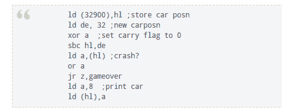

# 尝试你的组装和 ZX 光谱项目的基本技能

> 原文：<https://hackaday.com/2012/10/04/try-out-your-assembly-and-basic-skills-with-a-zx-spectrum-project/>

在汇编语言中准备编码真的很难。但是本教程试图让它变得容易理解和(几乎)简单。它专注于[为 ZX 谱](http://chuntey.wordpress.com/2010/01/12/tutorial-zx-spectrum-machine-code-game-30-minutes/)编程一个游戏。但是你不需要手边的硬件，因为你可以在编写代码时使用 ZX 自旋模拟器。

表面上这是一个 30 分钟的教程，但这是一个严重的低估。我们粗略地看完了教程，构建模块非常清晰易懂。但我们希望确保理解每一行代码，并计划在接下来的周末展开。

第一章通过将机器码与一些基础知识结合起来，使我们更容易理解机器码。您将看到如何操作 ZX 频谱内存，然后将该值提取回基本程序中。但是一旦第二章开始，从那以后就差不多都是组装了。好的一面是，随着您的学习，您将了解硬件是如何工作的，手册中有相当多的页面参考，因此您可以在学习过程中做一些额外的学习。

[谢谢马蒂尔达]