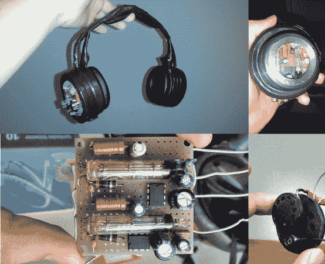

# 电子管耳机摇滚起来，同时保持家庭和睦

> 原文：<https://hackaday.com/2014/04/04/tube-headphones-rock-out-while-keeping-the-family-peace/>

做一个孩子有时很难。[年轻]喜欢他的音乐，但他的父亲是一个通宵卡车司机。由于爸爸白天在睡觉，[杨]必须把音量控制在合理的水平。他本可以买一些商用耳机，但他想要一些更个性化的东西。他没有放弃自己的音乐，而是制作了一副内置电子管前置放大器的耳机。【德语链接——谷歌翻译不想用这个，但 Chrome 的翻译功能可以用】。

两个 1SH24B 前置放大器管为两个 LM386 放大器芯片供电，构成一个混合放大器。1SH24B 电子管设计用于电池电压，因此不需要升压电路。然而，[Young]仍然需要提供一个 8 芯电池组来运行他的放大器。扬声器是[Young]自己设计的 3 路同轴电缆。他用商业耳机上的糖果罐和杯子制作了耳机框架。最后的接触是一个窗口，这样每个人都可以看到所有的真空状态的好处。考虑到[杨]只有 16 岁，我们期待他在未来有一些伟大的成就。

如果你不想把管子绑在你的头骨上[，还有其他选择](http://hackaday.com/2010/04/13/tiny-tube-amp-for-headphones/)。但你不得不承认这看起来很酷。星巴克我们来了。

[谢谢帕特里克]