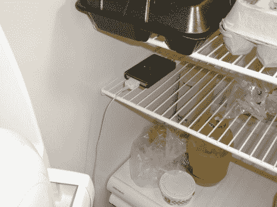

# 冰箱里的曲子

> 原文：<https://hackaday.com/2012/06/04/tunes-in-the-icebox/>

几年前，布莱恩的 iPod 出了故障。它没有完全坏掉，只要他把它保持在低温状态，它仍然可以工作。那么他该如何处理这个损坏的装置呢？我们都听说过电梯音乐。决定发明冰箱音乐。

首先，他需要一些扬声器。去了一趟友好商店，他花了不到 5 美元买了一双。他们需要交流电源，该项目依赖于感应冰箱门何时打开。他加了一个电灯插座转接头，一举两得。这提供了一个插入扬声器电源适配器的地方，只有当门打开时它才能获得电力。gimpy iPod 只是不断地循环播放存储在里面的曲目，但只有当门打开并且扬声器通电时，你才能听到它。当然，iPod 最终会耗尽自己的电池，所以[Bryan]在门外的墙上插座上放了一根延长线。这中断了门的密封，我们希望有另一种方法来保持它包含在里面。