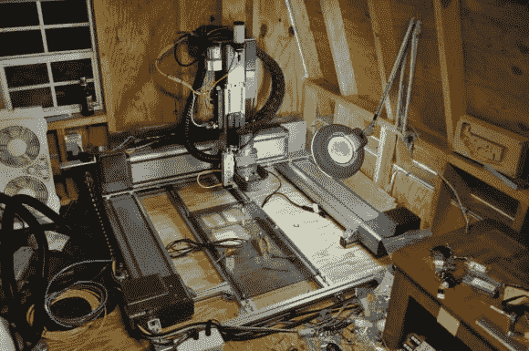

# 将退役的机器人改造成数控机床

> 原文：<https://hackaday.com/2013/09/26/turn-a-decommissioned-robot-into-a-cnc-machine/>

我们中的一些人可能会被指责住在妈妈的地下室里——[ Benjamin]把一个工业机器人放在他父母的~~阁楼~~棚子里，这更上一层楼。
【本雅明】被指派拆除一些工作中的退役设备。原来“退役设备”是 Adept Robotics 的三个笛卡尔机器人。这些是能够高速运动的大型工业 XYZ 平台(3000 IPM 急流！).

从一台退役的机器到一台正常工作的 CNC 从来都不是一条简单的道路。在这种情况下，[本]能够相对容易地完成转变。机器人的每个轴都有一个 400 瓦的 Yaskawa 伺服系统，带有 65k 编码器和制动器。原来的 Adept 伺服放大器和控制系统仍在工作，所以他保留了它。这些控制器足够新，可以通过菊花链式 IEEE1394 (Firewire)链路进行通信。与我们过去见过的一些[转换相比，这是相对现代的。拼图的最后一块是 ~~G 代码创建~~将普通 g 代码翻译成他的机器可以识别的格式。本选择了梅斯卡姆来完成这项任务。](http://hackaday.com/2013/09/24/lib3-plans-to-bring-contract-manufacturing-to-the-masses/)

[Ben]遇到的一个问题是在 X 轴上口吃。最初的机器在 X 轴上只有一个单侧驱动系统。对于看不到任何工具负载的装配机，单侧是好的。然而，对于一台将承受主轴负载的数控机床，单侧驱动会产生一个扭曲力，威胁到整个机架。他使用备用机器人中的一个驱动系统将他的主机转换为双面驱动，解决了这个问题。

[本]机器人的最终目标是加工高性能的汽车零件。我们会有点担心像这种磨钢的机器。铝挤压相当刚性，但它能承受这些铣削负载而不弯曲或刀具颤动吗？我们将会关注这一个来找出答案。

**更新:[** Ben]澄清了下面评论中的几点，并补充说他“目前看到的可重复精度约为 1/4000 毫米。”哇！

[https://www.youtube.com/embed/b9Xwj65hi0E?version=3&rel=1&showsearch=0&showinfo=1&iv_load_policy=1&fs=1&hl=en-US&autohide=2&wmode=transparent](https://www.youtube.com/embed/b9Xwj65hi0E?version=3&rel=1&showsearch=0&showinfo=1&iv_load_policy=1&fs=1&hl=en-US&autohide=2&wmode=transparent)