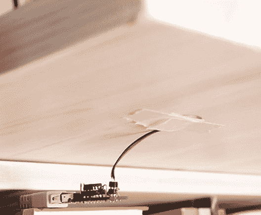

# 咚咚一声打开电脑

> 原文：<https://hackaday.com/2013/10/21/turn-a-pc-on-with-a-knock-and-an-attiny/>

按下电脑上的电源按钮通常不会太麻烦，除非你的电脑存放在一个很难拿到的地方。[Joonas]一直在努力研究一种解决方案，这种方案也会给他的朋友留下深刻印象，[制造一个爆震传感器来打开他的电脑](http://codeandlife.com/2013/10/20/turning-pc-on-with-a-knock-using-attiny45-and-a-piezoelectric-sensor/)。

他花了大约 10 美元组装了一个模拟 PS/2 设备的 ATTiny45，它利用了他的计算机在接收到 PS/2 输入后启动的能力。正如官方 Arduino 教程所展示的那样，该产品使用压电蜂鸣器和 1 米欧姆电阻作为爆震传感器，并且是最有可能潜伏在你办公室每个抽屉后角的 PS/2-USB 适配器之一。

[Joonas]使用 [AVRweb](http://codeandlife.com/avrweb/) 禁用 8X 时钟分频器，以便有足够的时钟周期用于 PS/2 通信，然后加载一些测试代码以确保正确检测到振动。你可以在这里查看他的 [Github 的最终代码](https://github.com/jokkebk/ps2kb)，休息后留下来看一个快速的视频演示。然后看看类似的黑客与[马修的] [家庭自动化敲门传感器](http://hackaday.com/2012/03/08/reinventing-the-clapper-with-a-knock-based-home-automation-controller/)。

[https://www.youtube.com/embed/FTVppOZquE8?version=3&rel=1&showsearch=0&showinfo=1&iv_load_policy=1&fs=1&hl=en-US&autohide=2&wmode=transparent](https://www.youtube.com/embed/FTVppOZquE8?version=3&rel=1&showsearch=0&showinfo=1&iv_load_policy=1&fs=1&hl=en-US&autohide=2&wmode=transparent)