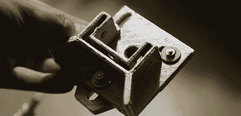

# 将 3D 打印变成铝铸件

> 原文：<https://hackaday.com/2012/09/25/turning-3d-prints-into-aluminum-castings/>

[Jeshua]需要一个激光头附件，用于他正在工作的 5×10 英尺数控机床。因为他有一台 3D 打印机，[Jeshua]可以很容易地打印一个激光底座，并将其连接到他的数控机架上，但这看起来不太专业。他没有用颜色鲜艳的塑料来装饰他巨大的机器，而是决定用 3D 打印的母片来铸造一个铝制激光头。

[Jeshua]在 OpenSCAD 中为他的激光切割机设计了两个部分，并在他的 3D 打印机上打印出来。粘上一些泡沫绝缘材料作为浇口，用 1 份熟石膏和 1 份操场沙制作一个熔模。

模子固化后，[约书亚]把模子放进一个咖啡罐炉子里，烧掉蜡和泡沫。这些空心模具被放在沙子里，坩埚里装满了铝屑。

完成的激光头完全适合他的数控机器——考虑到[Jeshua]需要考虑铝冷却后会收缩多少，这不是一个小壮举。对于一天的工作来说还不错。