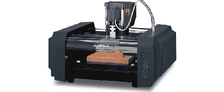

# 将一家 12 年的老工厂改造成现代化的大型工厂

> 原文：<https://hackaday.com/2012/08/09/turning-a-12-year-old-mill-into-a-modern-workhorse/>

尽管 Roland MDX-20 数控铣床在 12 年前第一次上市时卖了一大笔钱，但它的一些功能让任何有幸拥有一台机床的制造商都挠头不已。计算机与这家工厂通信的唯一方式是通过 RS-232 连接，而不是像 GCode 这样的*正常*控制协议，罗兰工厂使用非常专有的软件包。

[Johan] [解决了这些问题](http://vonkonow.com/wordpress/2012/08/bringing-a-12-year-old-roland-mdx-20-up-to-date/)同时将这台奇妙的机器变成了 21 世纪的工具。现在，他不再需要将一条很长的串行电缆连接到他的工厂，并在末端安装一个串行转 USB 转换器，而是只需将一条 USB 电缆插入他的工厂，并添加一个 FTDI USB 转串行芯片，直接连接到工厂的电路板。

股票，罗兰工厂使用了一个非常奇怪的专有通信协议。[Johan]能够通过描绘出一些简单的形状和曲线并使用荧光笔将结果文件打印出来来逆向工程这个协议。[Johan]现在可以直接从他的 CAD 程序中导出刀具轨迹，并通过 USB 电缆发送，而不是他的工厂随附的过时软件包。

像[Johan]的工厂这样的好机器在 12 年前遭受了罗兰高管的明显短视，这真是一个耻辱，但至少现在[Johan]有了一台应该可以轻松再用十年的机器。