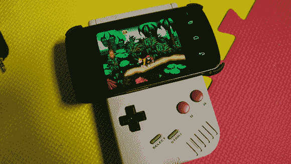

# 把游戏机变成安卓游戏手柄

> 原文：<https://hackaday.com/2013/01/09/turning-a-game-boy-into-an-android-gamepad/>

[Chad]一直在摆弄他手机上的模拟器，但是任何有智能手机的人都知道，即使是最先进的触摸屏控制也很糟糕。想要一些向他正在模仿的经典系统致敬的东西，他决定[将一个经典的老式砖块游戏男孩变成一个安卓游戏手柄](http://www.instructables.com/id/Game-Boy-Android-Gamepad/)。

在拆除了一台旧的 DMG-01 之后，[Chad]开始着手将 Game Boy 中的 D-pad 和按钮改造成他的 Galaxy Nexus 能够理解的东西。他选择了蓝牙连接为他的模拟器提供输入，硬件由任天堂 Wiimote 慷慨捐赠。

Game Boy 的 PCB 被切开，几根导线连接到 Wiimote 的 PCB 上。在修改了外壳，增加了 Wiimote 和手机支架的空间后，[Chad]有了一个功能游戏手柄，非常适合他在仿真中的冒险。

休息之后你可以看到[Chad]的游戏板演示，

[https://www.youtube.com/embed/BIPLcj3y7gA?version=3&rel=1&showsearch=0&showinfo=1&iv_load_policy=1&fs=1&hl=en-US&autohide=2&wmode=transparent](https://www.youtube.com/embed/BIPLcj3y7gA?version=3&rel=1&showsearch=0&showinfo=1&iv_load_policy=1&fs=1&hl=en-US&autohide=2&wmode=transparent)