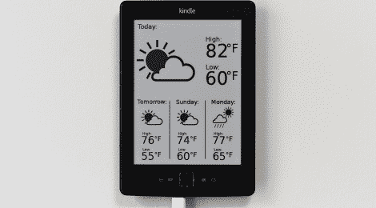

# 将 Kindle 变成天气显示器

> 原文：<https://hackaday.com/2012/09/17/turning-a-kindle-into-a-weather-display/>

自从[Matt]第一次看到电子纸显示器，他就有了将它作为定期更新的非实时显示器的想法。这真的是一个完美的平台，用于非常易读的日历、议程，或者像[Matt]发现的那样，用于天气显示。

[Matt]的构建使用服务器从 NOAA 获取并解析天气数据和预报[。然后将这些数据插入到 SVG 文件中，进行渲染，转换为 PNG，最后转换为 Kindle 所需的灰度、无透明度图像。](http://graphical.weather.gov/xml/)

在[Matt]的服务器制作好图像后，Kindle 上运行的一个小脚本获取图像，清空屏幕，并显示图像。整个过程每天发生两次，这足以让马特不用看窗外就能很好地了解外面的天气。

[马特]身材的真正显著特征是他的天气显示看起来有多好。这场天气展示的精彩图示部分来自于名词项目上的图形，其中有一些天气情况是由【Matt】自己绘制的。它看起来很棒，是一个出色使用电子纸的极好例子。