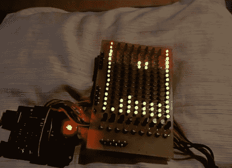

# 将 MIDI 音序器显示变成俄罗斯方块克隆

> 原文：<https://hackaday.com/2012/09/01/turning-a-midi-sequencer-display-into-a-tetris-clone/>

俄罗斯方块无疑是一个古老的游戏。尽管游戏很简单，但在某个地方的某个人总会找到一种方法将游戏移植到任何能玩它的电子设备上。

今年早些时候[我们向您展示了一个使用 Arduino Mega 构建的巧妙的 MIDI 音序器](http://hackaday.com/2012/04/13/arduino-midi-sequencer-displays-a-lot-of-data/)项目，该项目还碰巧驱动了一个极其详细的触摸屏显示器。[Christian]一定有一天对他的伟大创造感到厌倦了，因为他从他的 Arduino Sequencer 808 中取出了鼓级显示器，并将 led 阵列变成了一个迷你俄罗斯方块游戏。

正如你在下面的视频中看到的，游戏运行得很好，尽管我们可以看到它缺乏任何形式的记分。我们挖掘它是因为我们从来没有真正厌倦俄罗斯方块的克隆，我们认为他保持他的 808 序列器设计足够模块化是很棒的，他可以在其他项目中重复使用不同的组件。

[https://www.youtube.com/embed/T-g6dYaAvoA?version=3&rel=1&showsearch=0&showinfo=1&iv_load_policy=1&fs=1&hl=en-US&autohide=2&wmode=transparent](https://www.youtube.com/embed/T-g6dYaAvoA?version=3&rel=1&showsearch=0&showinfo=1&iv_load_policy=1&fs=1&hl=en-US&autohide=2&wmode=transparent)