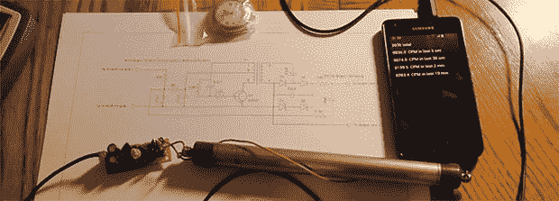

# 把手机变成盖革计数器

> 原文：<https://hackaday.com/2013/06/23/turning-a-phone-into-a-geiger-counter/>

我们对辐射探测器并不陌生，但[Dmytry]的[微型探测器原型](http://www.youtube.com/watch?v=UWRbWX35RIo)是我们见过的最小、最有用的一个。

微型耳机背后的想法来自于对几乎所有现代智能手机都可以通过麦克风插孔提供少量电源的观察。这通常用于麦克风，但如果电路正确，它可以升压到足以驱动盖革管。

[Dmytry]的电路使用手绕变压器，但器件数量较少；这种结构中只有几十个电容、电阻和二极管，使得电路比盖革管本身小得多。

由于[Dmytry]正在用手机给盖革管供电，所以他也应该用 Android 应用程序记录管中的点击，这才有意义。目前，整个项目仍处于原型阶段，但一切正常，他的应用程序可以检测到来自[Dmytry]来源之一的辐射。

GitHub 上的[提供了 MicroGeiger 的代码和原理图，下面是该项目的视频。](https://github.com/Dmytry/MicroGeiger)

[https://www.youtube.com/embed/UWRbWX35RIo?version=3&rel=1&showsearch=0&showinfo=1&iv_load_policy=1&fs=1&hl=en-US&autohide=2&wmode=transparent](https://www.youtube.com/embed/UWRbWX35RIo?version=3&rel=1&showsearch=0&showinfo=1&iv_load_policy=1&fs=1&hl=en-US&autohide=2&wmode=transparent)

# 