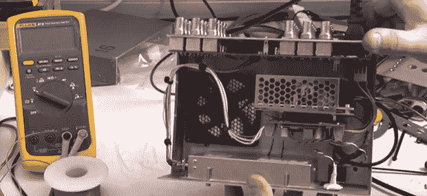

# 把铷标准变成合适的工具

> 原文：<https://hackaday.com/2013/08/05/turning-a-rubidium-standard-into-a-proper-tool/>

你可以找到遍布易贝和各种盈余经销商铷频率标准。它们实际上是非常有趣的设备，能够产生精度足够高的 10 MHz 正弦波，可以作为一个可用的原子钟。虽然这些标准在实验室中非常有用，但它们只是一个组件，而不是开箱即用的设备。[Gerry]决定他会解决这个问题，[把他的铷标准变成一个合适的实验设备](http://gerrysweeney.com/build-a-10mhz-rubidium-frequency-standard-and-signal-distribution-amp-for-my-lab/)，所有这些都在一个下午内完成。

[Gerry]的第一步是为他的新设备找到合适的外壳。大多数时候，选择一个外壳是一种妥协的艺术。不过，这一次，[格里]找到了完美的外壳:一台旧的视频分配设备。在这个盒子的背面，有一吨的 BNC 插头，非常适合连接到随机的实验室设备，并向它们提供来自铷标准的信号。

在完成视频电路并将 75 欧姆输出改为 50 欧姆后，[Gerry]连接了易贝电源、风扇和一个 8 针 PIC 小电路，完成了他的新工具。铷标准确实会变得异常热，但希望将它安装到一个稍加冷却的大铝盒中，可以保持所有附加的电子设备正常工作。

[Gerry]在不到 5 小时内完成了所有这些。一个令人印象深刻的壮举，考虑到他可能花了那么多时间编辑视频，如下所示。

[https://www.youtube.com/embed/chrzrod3tQY?version=3&rel=1&showsearch=0&showinfo=1&iv_load_policy=1&fs=1&hl=en-US&autohide=2&wmode=transparent](https://www.youtube.com/embed/chrzrod3tQY?version=3&rel=1&showsearch=0&showinfo=1&iv_load_policy=1&fs=1&hl=en-US&autohide=2&wmode=transparent)