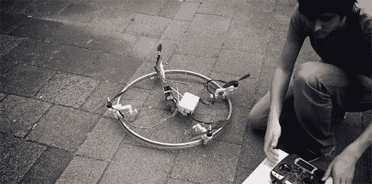

# 把任何东西变成无人机

> 原文：<https://hackaday.com/2013/07/08/turning-anything-into-a-drone/>

在他的毕业设计中，[Jasper]想用四轴飞行器做点什么。他不满足于简单地制造任何旧的无人机，他决定制造一个套件[，把*任何东西*变成无人机。](http://jaspervanloenen.com/diy/)从自行车车轮到电脑键盘，甚至是手机，一切都可以通过[Jasper]的无人机自己动手套件实现飞行。

DIY 无人机套件由几个 3D 打印零件组成，包括四个夹具和四个引擎的支架。机上还有电子稳定控制系统、电池、接收器和[open pilot](http://www.openpilot.org/)自动驾驶仪，它有望让无人机以任何可以想象的形状悬停在空中。所有这些都装在一个光滑的铝制公文包里，使它看起来像是一部古怪的邦德电影的仿制品。

这个项目是非卖品——至少在 Brookstone 目录窃取了这个想法之前——但你可以直接从[Jasper]那里得到[材料清单](http://jaspervanloenen.com/BOM.txt),以防万一你想制作自己的随机飞行物。

[https://player.vimeo.com/video/68841788](https://player.vimeo.com/video/68841788)