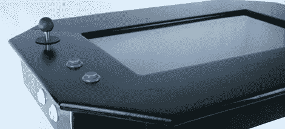

# 将覆盆子酱变成鸡尾酒 MAME 咖啡桌

> 原文：<https://hackaday.com/2012/11/04/turning-the-raspberry-pi-into-a-cocktail-mame-coffee-table/>

啊，鸡尾酒廊橱柜。通过正确的设计，它能够融入任何客厅装饰，至少比任何传统的立式橱柜都要好得多。[graham]在 Instructables 上没有为了他的新咖啡桌拆下一个有 30 年历史的拱廊橱柜。相反，[他从零开始建造了一个](http://www.instructables.com/id/Coffee-Table-Pi/?ALLSTEPS)，把它连接到一个 Rasberry Pi，并把数百个街机经典带到了他的沙发前。

建造开始于切割一些木头来放置 24 英寸的 LCD 屏幕、Raspi 和街机控制器。LCD 屏幕由一个相当聪明的交叉支撑系统支撑，该系统被拧入 VESA 支架，当然一块有机玻璃可以保护屏幕免受不可避免的溢出和划痕。

操纵杆的两个蓝色“播放器”按钮以及播放器 1 和播放器 2 按钮直接连接到 Raspberry Pi 的 GPIO 引脚。Raspi 引导进入一系列 MAME 游戏，但也有一个打开窗口管理器和浏览网页的选项。

这是一个非常整洁的建筑，比传统的鸡尾酒柜小得多(也更容易建造)。由于[graham]将它用作咖啡桌，它的用途可能比普通的 MAME 建筑还要多。