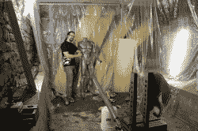
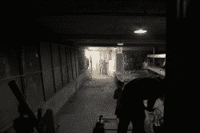
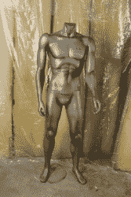

# 将红牛加农炮调至攻击模式

> 原文：<https://hackaday.com/2012/07/03/turning-the-red-bull-cannon-to-assault-mode/>

[https://www.youtube.com/embed/Y3njyx2u-X8?version=3&rel=1&showsearch=0&showinfo=1&iv_load_policy=1&fs=1&hl=en-US&autohide=2&wmode=transparent](https://www.youtube.com/embed/Y3njyx2u-X8?version=3&rel=1&showsearch=0&showinfo=1&iv_load_policy=1&fs=1&hl=en-US&autohide=2&wmode=transparent)

一旦我们完成并提交了红牛创作大赛的正式参赛作品，我们想我们也可以把事情做得更好，只是为了开心。我们在 Squidfoo 的地下室设置了一个射击场，并在瞄准镜中放置了“赫伯特”，一个前房客遗留在大楼里的人体模型。

我们发现了两件事。这东西很难精确瞄准。我们应该找一个激光器固定在枪管上。
2。“赫伯特”是宇宙中最强壮的人体模型。他几乎没有一个芯片在他身上，甚至从近距离！

