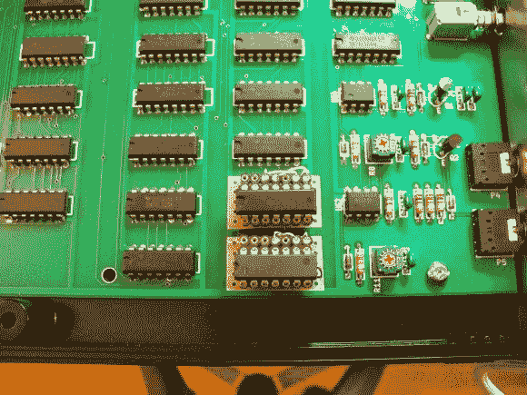

# 电视节目启发了这个更小的乒乓板硬件黑客

> 原文：<https://hackaday.com/2013/01/28/tv-show-inspires-this-smaller-pong-paddles-hardware-hack/>

当我们读到“更小的桨”时，我们会立即想到你手中握着的物理控制器。但是这个黑客[改变了电视屏幕](http://imgur.com/a/A5piX)上显示的虚拟乒乓球拍的大小。

我们非常清楚地记得 70 年代节目中的一集，瑞德和凯尔索拆开他们的乒乓机器来破解它。休息后的视频[蓝调图像]将那一集的场景与他的黑客图像混在一起。角色们坚持认为这个游戏太简单了，减小虚拟桨的尺寸是唯一能让它再次变得有趣的事情。在[根据原始原理图](http://hackaday.com/2012/12/22/fabricating-hardware-from-the-original-arcade-pong-schematics/)建造了自己的硬件之后，【蓝色图像】认为这个挑战值得一试。

他的解决方案是以两个中间人板的形式插入一种方法，在不改变主板的情况下重新路由引脚。其中一个芯片用来画球拍，另一个用来检查与球的碰撞。通过改变引脚排列，拨片从 15 个像素减少到 7 个像素。

[https://www.youtube.com/embed/Y6RgSupljYM?version=3&rel=1&showsearch=0&showinfo=1&iv_load_policy=1&fs=1&hl=en-US&autohide=2&wmode=transparent](https://www.youtube.com/embed/Y6RgSupljYM?version=3&rel=1&showsearch=0&showinfo=1&iv_load_policy=1&fs=1&hl=en-US&autohide=2&wmode=transparent)

[via [Reddit](http://www.reddit.com/r/electronics/comments/17cbxm/inspired_by_an_episode_of_that_70s_show_pong_with/)