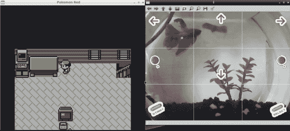

# 抽搐的鱼在水下玩口袋妖怪

> 原文：<https://hackaday.com/2014/08/09/twitching-fish-plays-pokemon-underwater/>

在几天的时间里，数千人同时观看这条名为[Grayson Hopper]的鱼在一碗水中漂浮,网络摄像头记录下它的每个动作，并将它采取的方向转化为口袋妖怪红的工作游戏。坦克的每个部分都被分割成几个部分，每个部分就像一个按钮。所以当鱼游过特定区域时，主要的口袋妖怪角色[Ash]被告知去哪里。

它是在 24 小时内的一次黑客马拉松中创造的，当时这条鱼开始了它进入口袋妖怪世界的旅程。已经有一个[子编辑](http://www.reddit.com/r/fishplayspokemon)弹出来记录这次冒险。令人惊讶的是，[格雷森]选择小火龙作为它的首发口袋妖怪，并击败了它的对手杰尼龟。

这个项目非常适合连续观看几个小时，尤其是在工作的时候，因为这条可爱的小鱼开始了它的生活，却没有意识到它正在成为一个受欢迎的网络明星。

点击上面的链接观看视频。边上甚至还有一个聊天栏，任何人都可以加入到这种可疑的对话中。如果这条鱼看起来已经死了，它可能只是在睡觉。

【谢谢提示贝利！]

此外，[口袋妖怪最近重生了一些老式硬件](http://hackaday.com/2014/08/04/pokade-twitch-plays-pokemon-reborn-on-vintage-hardware/)，允许玩家通过网络游戏。也看看那个！