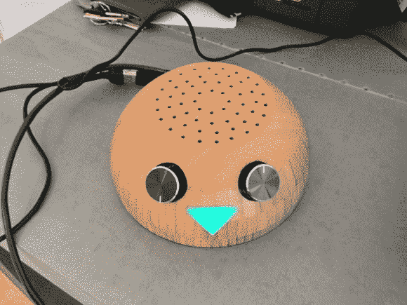

# 推特电台

> 原文：<https://hackaday.com/2012/12/12/twitter-radio/>

这个拟人化的[木碗会大声朗读推文](http://itp.nyu.edu/~wdl225/work/?p=286)。它是由[威廉·林德梅尔]建造的，作为他在纽约大学交互式电信项目(ITP)的研究生工作的一部分。在休息后观看剪辑，以相当愉快的文本到语音转换的声音从他的 Twitter feed 中看到和听到一个列表。

所涉及的电子学相当复杂。在翻过来的碗里，你会发现一个 Arduino 和一个 Raspberry Pi。但这不是唯一的原因。[William]能找到的最好的文本到语音转换程序是为 OSX 设计的，所以也涉及到一台远程计算机。但我们认为这个特别之处在于理念和执行，而不是硬件低效的程度。

左边的旋钮设置音量，也负责关闭设备。右边的旋钮可以让你从各种 Twitter 列表中进行选择。每转动一次旋钮，鼻子上就会有不同颜色的 LED 灯和一个语音菜单标签。你可以从[这篇总结文章](http://itp.nyu.edu/~wdl225/work/?p=275)中快速了解该项目的概况。

[https://player.vimeo.com/video/55184622](https://player.vimeo.com/video/55184622)