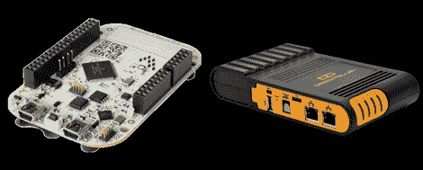

# 两块有趣的板子从管子里下来

> 原文：<https://hackaday.com/2012/06/29/two-interesing-boards-coming-down-the-pipe/>

嘿，这是硬件一箭双雕！这里有两个平台正在铺设管道:

首先是 [Mimo Dreamplug](http://www.mimomonitors.com/products/mimo-dreamplug) ，这是为非常小的单板 Linux 计算机持续扩展选择的最新产品。Dreamplug 应该能够胜任你交给它的任何任务。凭借 1.2GHz Marvell Sheeva CPU、eSATA、光纤/TOSLINK、WiFi、蓝牙、两个千兆以太网连接和 512*MB*RAM，我们认为这几乎可以用于任何事情。250 美元有点贵，但这是你为所有这些功能付出的代价。~~虽然不知道什么时候可以买到。没关系，你可以在这里花 150 美元买到同样的东西。谢谢，[斯科特]。~~

接下来是 [Kinetis KL25Z Freedom 开发板](http://www.element14.com/community/community/knode/dev_platforms_kits/element14_dev_kits/kinetis_kl2_freedom_board?view=overview)，这是一款兼容 Arduino、基于 Cortex-M0+的开发板，可供预购。这台机器的规格似乎很好——有了 48MHz ARM 芯片、板载加速度计、内置在 PCB 中的电容触摸“滑块”和用于 USB 调试接口的 OpenSDA，您应该可以用这块板做一些很酷的项目。作为一个很好的奖励，它的价格是 13 美元，飞思卡尔正在赠送他们的 Codewarrior 开发环境的一个版本(限于 128kB，但这是 Kinetis 所有的闪存)。希望，这将是一个更加[开放的开发平台](http://hackaday.com/2012/06/19/stm32-demo-code-carries-extra-hidden-copyrights/)，而不是我们自己的【Mike Szczys】能够从 STM32 板中[争论出来的。Kinetis 应该会在今年秋天上市。](http://hackaday.com/2012/06/17/template-for-building-stm32f0-discovery-project-in-gcc/)

感谢[Impulse405]和[Hussam]发送这些提示。