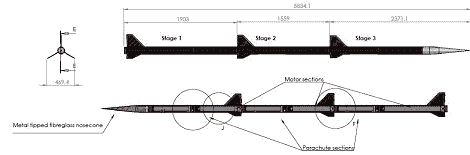

# 二级火箭爬升到 15 公里，迅速消失

> 原文：<https://hackaday.com/2012/07/11/two-stage-rocket-climbs-to-15-km-promptly-gets-lost/>

上个月，剑桥大学航天学会发射了他们的两级 Martlet 1 三级火箭 t 1。在看到[我们呼吁建造](http://hackaday.com/2012/07/09/ask-hackaday-how-about-some-model-rocket-hacks/)火箭后，他们送来了一份发射报告。我们很高兴他们这样做了；这是一件令人惊叹的作品，它以超过音速的速度尖叫着进入大气层。

该协会设计了三级 Martlet 1，目标是在苏格兰的 Ben Armine 发射场飞行 15 公里(50，000 英尺)。这次发射是对级间分离的测试，目的是在进入全尺寸火箭之前解决系统中的任何问题。

当 Martlet 1 起飞时，它的第一级发动机点火 5 秒钟，再滑行 9 秒钟。在休息后的视频中，伙计们期待在 14 秒后听到第二级点火的*砰的一声*。该小组忘记了考虑这样一个事实，即当时火箭将在 3 公里的空中，由于声音的缓慢，在发射后 25 秒通过云层听到了第二级。

对于火箭来说，几乎没有什么事情是完全按照计划进行的，所以不幸的是，团队只回收了火箭的下半部分。在搜索了超过 60 平方公里的第二阶段后，这些人意识到它可能会被苏格兰的摩尔人遗忘。希望第二阶段将很快出现，这样就可以实现完整的 3 阶段堆栈。

休息之后，请观看发布视频。

#### 从 300 米处发射

[https://player.vimeo.com/video/41699601](https://player.vimeo.com/video/41699601)

#### 慢动作

[https://player.vimeo.com/video/41698742](https://player.vimeo.com/video/41698742)

#### 轨道凸轮

[https://player.vimeo.com/video/41698743](https://player.vimeo.com/video/41698743)