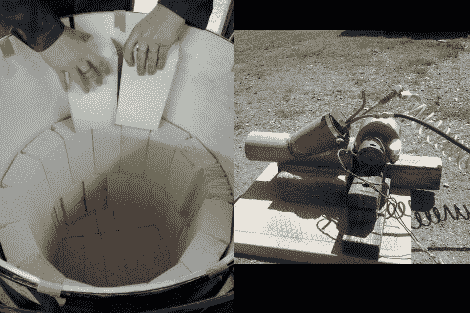

# 铸造厂的三分之二

> 原文：<https://hackaday.com/2012/07/03/two-thirds-of-a-casting-foundry/>

[Th3BadWolf]决定承担一个史诗级的铸造项目。这个建筑最难的部分显然是熔化金属的设备。它需要一个经得起热的器皿，一个有足够热功率熔化金属的加热方法。他[刚刚完成了建造](http://badwolf.hackhut.com/2012/07/02/smelting-foundry-part-ii/)的燃烧器部分。他的文章包括了完成[号船的水泥浇铸的信息，他已经在这艘船上做了很多工作](http://hackaday.com/2012/06/12/building-a-foundry-in-your-backyard/)。

你会记得，对于围栏，他从一个油桶开始，并用陶瓷毯做衬里。内衬耐火砖。在这次更新中，他把一个更小的桶放在里面作为内部模型，然后用 3000 度的水泥填充剩余的空隙。

燃烧器喷射空气、丙烷和油，它们都由鼓风机驱动，通过喷嘴进入燃烧室。休息后，您可以观看快速鼓风机和燃烧器测试剪辑。我们迫不及待地想看到下一个帖子，我们假设这将是最终装配的测试运行。

[https://www.youtube.com/embed/wqNhJQ6lX_4?version=3&rel=1&showsearch=0&showinfo=1&iv_load_policy=1&fs=1&hl=en-US&autohide=2&wmode=transparent](https://www.youtube.com/embed/wqNhJQ6lX_4?version=3&rel=1&showsearch=0&showinfo=1&iv_load_policy=1&fs=1&hl=en-US&autohide=2&wmode=transparent)