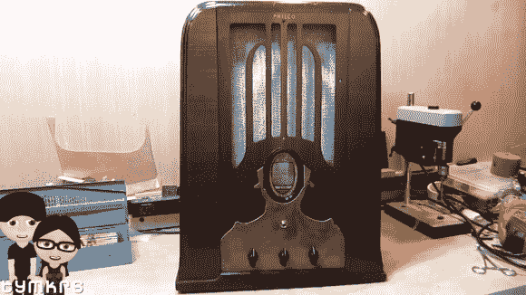

# [Tymkrs]墓碑吉他放大器

> 原文：<https://hackaday.com/2014/06/30/tymkrs-tombstone-guitar-amplifier/>

[tym krs]YouTube 频道背后的团队[Atdiy and Whisker]又开始了墓碑吉他放大器项目。(YouTube 播放列表链接)他们的 amp 最初是一家 Philco Tombstone 电台，曾经风光过。当[Tymkrs]得到它的时候，它只是一个以前的自己的外壳，因为有人已经把所有的电子设备都拿走了。

放大器本身是一个废弃的莱斯利电子管放大器[Tymkrs]手头。一个 LM386 充当前置放大器，使这成为一个混合固体和真空状态机。

墓碑音箱特别有意思。[Tymkrs]配有一个[电动力场线圈扬声器](http://www.radioremembered.org/edspeaker.htm)。场线圈扬声器没有磁铁，而是使用一个高压(约 90V DC)线圈来产生一个磁场，供音圈推动。这种扬声器在 20 世纪 30 年代很常见，因为大型磁铁的重量不足以在扬声器中使用。随着磁体技术的进步，永磁体成为扬声器中的主要部件。

[Tymkrs]特别注意放大器的完成。他们让陈旧的收音机重新焕发光彩，然后添加了一个受 Metropolis 启发的覆铜板。结果是一个放大器，看起来很棒，听起来也很棒！

[https://www.youtube.com/embed/CRLCMTGmUaA?version=3&rel=1&showsearch=0&showinfo=1&iv_load_policy=1&fs=1&hl=en-US&autohide=2&wmode=transparent](https://www.youtube.com/embed/CRLCMTGmUaA?version=3&rel=1&showsearch=0&showinfo=1&iv_load_policy=1&fs=1&hl=en-US&autohide=2&wmode=transparent)