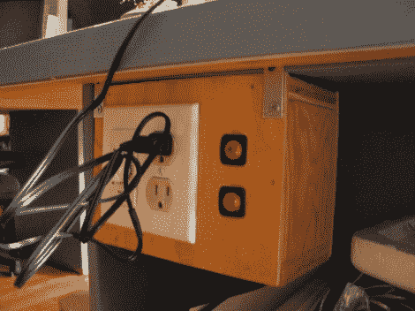

# 板凳下的定时插座不会让你离开熨斗

> 原文：<https://hackaday.com/2012/06/30/under-bench-timed-outlets-wont-let-you-leave-the-iron-on/>

当我们过去使用 firesticks(笔式插入式烙铁)时，总是担心我们可能会把它们留在上面。但是现在我们用一个有指示灯的底座来提醒。尽管如此，[foxtexx]没有冒险，而是[建造了这个基于定时器的插座](http://www.insentricity.com/a.cl/146/AlmostBurnedMyHouseaDown)，它会自动切断电源。

这些零件都很普通。定时器本身的外形与电灯开关相同，通常用于加热灯或热水浴缸喷头。它通过右边的指示器开关向旁边的插座供电。我们喜欢使用开关，但由于电源电压仍然通过它们，我们建议使用三组盒，并将它们安装在盖板上，以便包含所有布线。如果这样做，你可以把电箱放在你的工作台上，但这样安装是一个不错的选择。

我们一直是计时器系统的支持者。回到[当我们组装黑客的焊接站](http://hackaday.com/2008/08/05/how-to-the-hackers-soldering-station/)时，我们只是使用了一个插入式计时器单元。