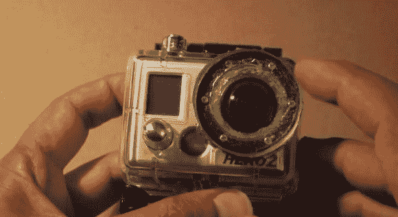

# 水下 GoPro 英雄 2 又看清楚了

> 原文：<https://hackaday.com/2014/05/11/underwater-gopro-hero-2-sees-clearly-again/>

GoPros 是很棒的动作相机，可以在你通常不能带真正的相机设备的地方捕捉照片和视频。问题是，即使有了 Hero 2 的防水 GoPro 外壳，水下视频也往往模糊不清。由于对自己的视频不满意，[米切尔]决定为这个案子制作自己的镜头！

防水外壳有一个可拆卸的凹透镜，但不管什么原因，它在水下不太好。幸运的是，它很容易用 6 个螺丝拆除，露出一个漂亮的厚垫圈和镜头。他没有试图用一个坏掉的相机上的一些玻璃元素来装饰，而是用了一些 1/4 英寸的有机玻璃，并剪下一片来适合这个盒子。对于最初的配置来说，它有点太厚了，所以他实际上颠倒了扣环，以使镜头远离实际的相机。一堆硅胶后，该案件是防水再次与新的镜头！

使用新镜头拍摄的镜头在水下看起来棒极了——休息后一睹为快。

[https://www.youtube.com/embed/rDsEoPOeNw8?version=3&rel=1&showsearch=0&showinfo=1&iv_load_policy=1&fs=1&hl=en-US&autohide=2&wmode=transparent](https://www.youtube.com/embed/rDsEoPOeNw8?version=3&rel=1&showsearch=0&showinfo=1&iv_load_policy=1&fs=1&hl=en-US&autohide=2&wmode=transparent)