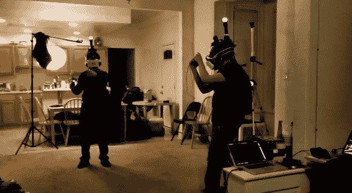

# 大学研究资金投入到全息甲板的开发中

> 原文：<https://hackaday.com/2013/02/12/university-research-dollars-poured-into-developing-a-holodeck/>

这可能看起来像是一个早期的愚人节玩笑，但上面的图片显示了认真的研究在行动。[Ben Lang]最近有机会采访一个想让全息甲板成为现实的项目的负责人。这项名为[项目全息甲板](http://www.projectholodeck.com/)的研究的核心目标是在实验室之外开发一种负担得起的多人虚拟现实体验。我们听说索尼和微软将在 2013 年发布他们的下一代系统；我们宁愿等它上市。

[内森·伯巴]是这个项目的负责人。它是南加州大学游戏学院的一部分，汇集了互动媒体、电影艺术和工程的学生。休息过后，视频的开头展示了每个玩家佩戴的硬件。大部分组件都是市场上可以买到的(一台联想笔记本电脑，放在背包里，PlayStation 控制器等等。)但是立体显示器是专门为这个项目开发的，它能让每只眼睛都有自己的 90 度视角。

在看到游戏中渲染的镜头后，我们不禁想到用这种设备玩一些《我的世界》。我们只需要某种类型的[全方位跑步机](http://hackaday.com/2012/08/31/the-simulacrum-an-innovative-solution-to-walking-in-virtual-reality/)，因为我们的客厅空间非常有限。

[https://www.youtube.com/embed/0UtnxVMAFPs?version=3&rel=1&showsearch=0&showinfo=1&iv_load_policy=1&fs=1&hl=en-US&autohide=2&wmode=transparent](https://www.youtube.com/embed/0UtnxVMAFPs?version=3&rel=1&showsearch=0&showinfo=1&iv_load_policy=1&fs=1&hl=en-US&autohide=2&wmode=transparent)