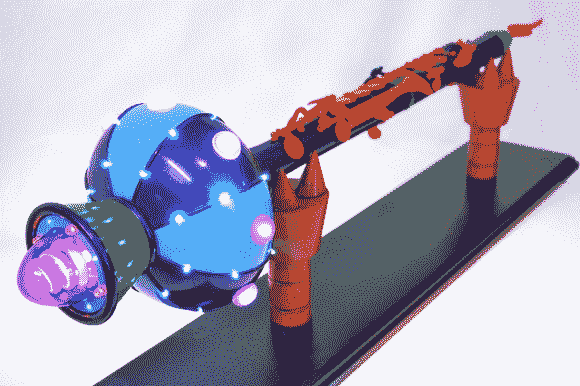

# 不可播放的全息复制品不可播放

> 原文：<https://hackaday.com/2013/08/22/unplayable-holophonor-replica-is-unplayable/>

你不会在 Hackaday 找到这么多道具或自制的复制品，但[Harrison Krix]的作品是首屈一指的，他的[*Futurama*全息眼镜复制品](http://www.volpinprops.com/holophonor-futurama/)值得流口水。[哈里森]从当地的旧货店买了一个旧的(显然很脏的)单簧管，他把它的琴键和附件剥得干干净净。身体本身从车床和环氧树脂接收一些微妙的修改，以堵塞一些洞。定制的旋转塑料片完成了身体的其余部分，包括精心制作的钟，里面有 54 个发光二极管。

[Harrison]还为迷你 Arduino Pro 设计了一个分线板，有 4 个渐暗和 4 个闪烁通道，以及一些为 Holophonor 底座定制的电源选项:一个临时建造的玻璃纤维 AAA 电池座和可选的交流适配器插孔。作为一个额外的奖励，他给全息摄影仪的支架安装了一组机器人恶魔之手来固定它。唯一的视频是照明测试，但它肯定是漂亮的。下面可以看到！它看起来很完美，但可惜无法播放，这实际上使它更加真实。

全息仪是沃尔平道具公司一系列作品中的最新作品。你可能还记得几年前[Harrison]的第一个[蠢朋克头盔](http://hackaday.com/2010/07/24/daft-punk-helmet-replica-finally-completed/)，或者[随后不久的第二个](http://hackaday.com/2011/10/05/iphone-controlled-daft-punk-helmet-replica-a-dazzling-build/)。

[https://www.youtube.com/embed/VzHRrBm_YSY?version=3&rel=1&showsearch=0&showinfo=1&iv_load_policy=1&fs=1&hl=en-US&autohide=2&wmode=transparent](https://www.youtube.com/embed/VzHRrBm_YSY?version=3&rel=1&showsearch=0&showinfo=1&iv_load_policy=1&fs=1&hl=en-US&autohide=2&wmode=transparent)