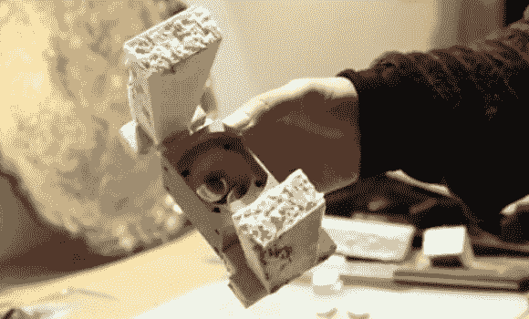

# 更新:失落的解放军金属铸造-电影

> 原文：<https://hackaday.com/2013/05/10/update-lost-pla-metal-casting-the-movie/>

将 3D 打印的塑料零件变成金属物体并不是一个新概念。但是我们看得不多，很喜欢看[3DTOPO 的]失传 PLA 金属铸造过程的纪录片版本，所以我们认为你也想看。

这个 35 分钟的视频讲述了我们最初在去年 9 月了解到的[过程的每一个部分。该工艺是作为一种制造将在高应力应用中使用的部件的方法而开发的。例如，上面看到的部分是一个滚珠丝杠的安装支架，它在他一直在工作的一个巨大的 CNC 构建上移动 Z 轴。塑料零件在压力下会断裂，所以他需要用铝合金制造。](http://hackaday.com/2012/09/25/turning-3d-prints-into-aluminum-castings/)

首先，用塑料制作并打印出这件衣服，以检查是否合身。一旦它刚刚好，他将它缩放到 103%，并再次打印，以解决金属冷却时的收缩。下一步如上图所示，使用硬质泡沫绝缘材料添加路径，以允许金属浇注和空气逸出。这是装在一个石膏和沙模，干燥后，在炉子里煮，蒸发泡沫和解放军。这为金属浇注留下了一个完美的模型。

休息后，你可以看到一个 5 分钟的项目概述版本。

[https://www.youtube.com/embed/0bxOzCgUj_U?version=3&rel=1&showsearch=0&showinfo=1&iv_load_policy=1&fs=1&hl=en-US&autohide=2&wmode=transparent](https://www.youtube.com/embed/0bxOzCgUj_U?version=3&rel=1&showsearch=0&showinfo=1&iv_load_policy=1&fs=1&hl=en-US&autohide=2&wmode=transparent)