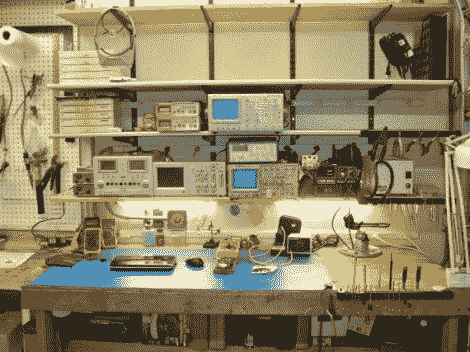

# 更新您的工作空间，实现更有组织、更高效的黑客攻击

> 原文：<https://hackaday.com/2012/04/01/updating-your-workspace-for-more-organized-and-efficient-hacking/>

如果你曾经仔细看过(托德·哈里森的)拆卸或操作视频，你可能会注意到他的工作台看起来像一个标准的黑客工作区。虽然我们都试图保持我们的工作区域整洁，但组件堆积、电线缠绕和东西变得凌乱并不罕见。[【托德】决定是时候变得更有条理一点了](http://www.toddfun.com/2012/03/31/tech-bench-upgrade-with-30-outlets-and-4-shelves/)，所以他录了一段视频展示他是如何进行这个过程的。

[托德]的部分工作是在他的工作台上增加架子，这样他就不会把测量设备一个叠一个地堆放起来。他还花了大量时间在他的工作空间增加了 30 个额外的插座，取代了他多年来一直在努力的那个插座。

显然，这本身并不是真正的黑客攻击，尽管这种重组对高效的黑客攻击仍然很重要。我们喜欢[Todd]花时间详细解释他的过程和材料——这无疑会对那些黑客新手有所帮助。

继续阅读查看[Todd]的完整视频，或者浏览他的博客获取更多图片和细节。

[https://www.youtube.com/embed/JYtp7P9GPD0?version=3&rel=1&showsearch=0&showinfo=1&iv_load_policy=1&fs=1&hl=en-US&autohide=2&wmode=transparent](https://www.youtube.com/embed/JYtp7P9GPD0?version=3&rel=1&showsearch=0&showinfo=1&iv_load_policy=1&fs=1&hl=en-US&autohide=2&wmode=transparent)