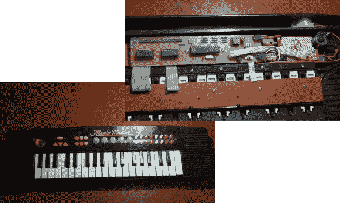

# 升级玩具键盘的音色

> 原文：<https://hackaday.com/2013/04/17/upgrade-a-toy-keyboards-tone-production/>

[Jan]得到了这个玩具键盘，并决定将它作为他下一个项目的主题。除了有三个八度键之外，它还有一大堆用于选择不同模式的按钮。他对它进行了升级，安装了自己的发声电路,见右上角。

他对库存部件的初步调查发现了一个被一团黑色环氧树脂包裹着的神秘 uC。他不会有任何进展，所以他开始弄清楚如何使用 4051 多路复用器来读取所有的密钥。其输出被路由到一个 20 引脚接头，以便轻松连接到他将在项目的下一部分构建的合成器板。他以 ATmega8 为基础，我们知道 atmega 8 可以产生一些杀手级的音频。一旦一切正常，他就在 Kicad 中设计了一个电路板，以确保移植的电路能够在玩具键盘内部运行。休息之后，你可以在剪辑中听到所有不同的效果。

[https://www.youtube.com/embed/hrUaMH5wTPY?version=3&rel=1&showsearch=0&showinfo=1&iv_load_policy=1&fs=1&hl=en-US&autohide=2&wmode=transparent](https://www.youtube.com/embed/hrUaMH5wTPY?version=3&rel=1&showsearch=0&showinfo=1&iv_load_policy=1&fs=1&hl=en-US&autohide=2&wmode=transparent)