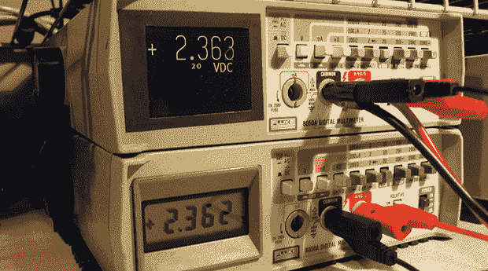

# 升级福禄克万用表与一个熟练的补充

> 原文：<https://hackaday.com/2013/08/23/upgrading-a-fluke-multimeter-with-a-masterful-addition/>

80 年代的老福禄克 8050a 万用表是一个非常棒的实验室设备。它的构造就像一个坦克，由于更新更便携的模型，这种旧的仪表在易贝可以以很低的价格买到。[Ken]挑选了几个这样的仪表，并决定对其中一个进行一点升级—[一个 2.2 英寸 320×240 的液晶显示屏](https://sites.google.com/site/kenselectronicsprojects/fluke8050a_display),这是对旧的七段数字显示屏的巨大改进。

在 Fluke 8050a 内部是一个 40 针 DIP 处理器，处理单元内部的所有计算。[Ken]开发该处理器的解决方案是采用一个 40 引脚 PIC 微控制器，将一些引脚向后弯曲，并使用剩余的引脚来驱动新的 LCD 显示器。实际上，它的简单性很棒[，启动起来看起来也很酷](https://sites.google.com/site/kenselectronicsprojects/_/rsrc/1376937228398/fluke8050a_display/IMG_0454.JPG?height=240&width=320)。

电路的其余部分由一个电平转换器和几根直接连接到 LCD 显示器的电线组成。[Ken]已经有另一个 Fluke 8050a 在等待翻新，并计划进行一些改进，包括条形图、直方图，甚至可能是触摸显示屏。