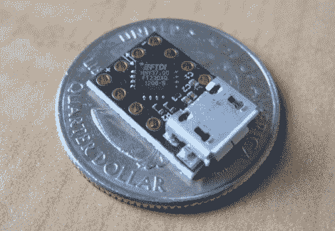

# 非常非常小的 USB 连接

> 原文：<https://hackaday.com/2012/05/11/usb-connectivity-that-is-so-very-very-small/>

使用 FTDI 芯片作为 USB 到串行的解决方案并不是什么新鲜事，但是[这款 MicroFTX 板](http://jim.sh/ftx/)将尺寸降到了新低。如果你的空间有限，这应该没有问题，适合你的项目。但是如果你打算用它做原型，我们预测一旦你把目光从它身上移开，它就会永远消失在零件箱里。

USB Mini-B 连接器最近在业余电子爱好者中变得非常流行。但在这里[吉姆·帕里斯]选择使用它的小兄弟，USB 微型连接器。想手工组装这个吗？0402 脚印和 QFN 芯片怎么样了？事实上，该 IC 底部有一个接地焊盘，这意味着您确实需要使用回流焊炉来正确完成工作。

除了对 diy 不友好的制作尺寸，我们确实喜欢这个设计。有四个输出引脚(电压、地、TX 和 RX)，并配有一组四个跳线来配置它们。它可以通过 USB 端口或外部连接供电，可选择 5V 或 3.3V 输出。

[谢谢约翰]