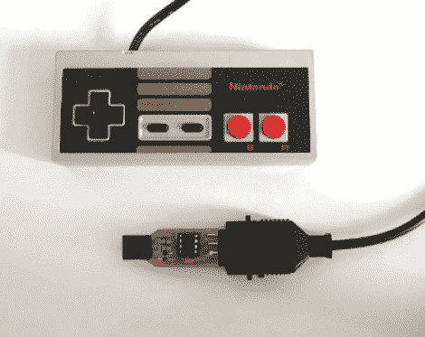

# 用于未改装的 NES 控制器的 USB 加密狗

> 原文：<https://hackaday.com/2012/07/19/usb-dongle-for-unmodified-nes-controllers/>

这个 USB 加密狗可以让你在电脑上使用未经修改的 NES 控制器。这是因为它包括了你在传统游戏机上能找到的相同插座。

上图显示的是原型。不是蚀刻覆铜板，而是手工研磨每个走线(可能使用旋转工具)。左边的黑色方块是由几层电工胶带制成的，这些胶带将基板构建得足以紧贴 USB 端口。

运行 V-USB 堆栈的 ATtiny45 在读取控制器数据并将其格式化以用作 USB 设备时没有问题。这实际上是项目的第二次迭代。[第一次尝试使用 ATtiny44 和控制器内部的自由形式电路](http://www.bidouille.org/hack/nespadusb)。它工作得很好，但需要改变电路板，你需要用一个 USB 插头取代普通的连接器。这个加密狗允许控制器保持不变，以便将来可以再次与 NES 控制台一起使用。