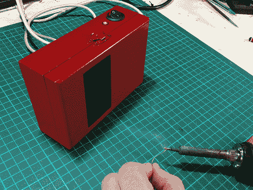

# USB 抽油烟机消除焊接过程中的臭味

> 原文：<https://hackaday.com/2013/06/02/usb-fume-extractor-takes-stink-out-of-soldering-sessions/>

我们自制的车间工具很少达到这种成品质量水平。我们可能会停止组装这个 USB 供电的抽油烟机。但是[X2jiggy]通过添加一层油漆来追求时尚。

他的体格中有几个很好的特征。他希望为设备供电非常容易，所以他选择了 5V USB 标准。但是一个运行在 5V 的电脑风扇不会吸太多的空气。他使用升压转换器板将电压提升至 12V。这个附件是一个木制的业余爱好盒。他在盒子底部为风扇钻了安装孔和气流孔。盒子的盖子有一个长方形的开口，可以接受水族馆用的碳过滤器。上面看到的摇杆开关和 LED 也是不错的选择，但如果你是为自己设计的，就没有必要了。

我们仍然习惯在焊接时轻轻吹走烟雾。所以问题是，这种设备能让我们免于一种可怕的疾病，还是主要用来捕捉焊料烟雾的气味？

寻找一个更永久的设置？你应该[为你的工作台建造一个焊接罩](http://hackaday.com/2008/08/05/how-to-the-hackers-soldering-station/)。

[https://www.youtube.com/embed/LhZtQ0UQj6c?version=3&rel=1&showsearch=0&showinfo=1&iv_load_policy=1&fs=1&hl=en-US&autohide=2&wmode=transparent](https://www.youtube.com/embed/LhZtQ0UQj6c?version=3&rel=1&showsearch=0&showinfo=1&iv_load_policy=1&fs=1&hl=en-US&autohide=2&wmode=transparent)