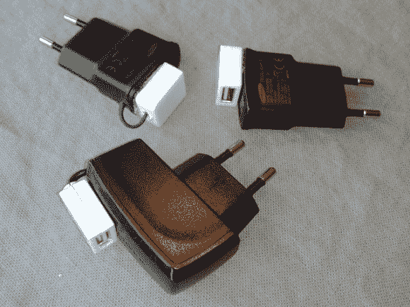

# 将你的旧手机充电器 USB 化

> 原文：<https://hackaday.com/2014/03/12/usb-ify-your-old-cell-phone-chargers/>

如果你和我们一样，你可能有一盒(或更多)壁疣藏在某个地方的壁橱或架子上。根据你收集手机的时间长短，这个盒子里可能装满了 5V 充电器:所有的都有不同的连接器。通过做[马丁·梅尔基奥]所做的事情让它们起死回生:[切掉末端，焊接上一串 USB 插孔](http://www.martinmelchior.be/2014/03/give-your-old-phone-chargers-second-life.html)。

对于这个项目，你可能想要使用额定至少 500 毫安(如果不是 1A)的充电器，或者你可能会浪费时间去考虑现在的设备消耗了多少电流。把极性接好，焊上 USB 插口，就大功告成了。当然，这是一个不用动脑筋的项目，但它可以清理你的一些衣柜，并为你家里和办公室的每个房间提供一个充电站。[Martin]将 USB 插孔直接粘在适配器上，所以不用担心电线缠结。如果你想让你的苹果设备充电，iPhone 用户[将需要做通常的功夫](http://hackaday.com/2010/08/03/reverse-engineering-apples-recharging-scheme/)。