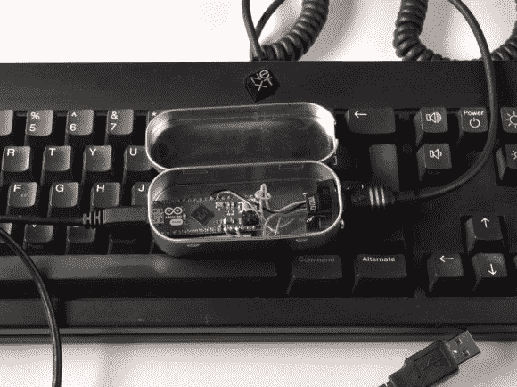

# USB NeXT 键盘

> 原文：<https://hackaday.com/2012/12/09/usb-next-keyboard/>

[Ladyada]和[pt]有一个 NeXT 的旧键盘，但是因为它使用了一个自定义协议，所以不能用于现代硬件。因此，他们建立了一个定制设备，将 [NeXT 协议转换为 USB](http://learn.adafruit.com/usb-next-keyboard-with-arduino-micro/overview "NeXT USB Keyboard") 。

该设备使用 Arduino Micro 从键盘读取数据，并通过 USB 作为 HID 设备进行通信。它使用原始的 mini-DIN 连接器连接到键盘，并位于经典的 Altoids 锡外壳中。

由于 NeXT 使用的协议不是标准的，他们不得不找出它并编写一些代码来解释它。键盘与计算机双向通信，所以他们需要发送正确的帧来输入数据。

幸运的是，他们偶然发现了一个日本键盘爱好者的网站，上面有协议规范。他们在微处理器上实现了这个协议，并使用[键盘库](http://arduino.cc/en/Reference/MouseKeyboard "MouseKeyboard Library")创建了一个 HID 设备。

最终产品是 NeXT to USB 的适配器，它允许旧键盘在任何带 USB 的计算机上使用。这是让一些无用的古董硬件起死回生的好方法。