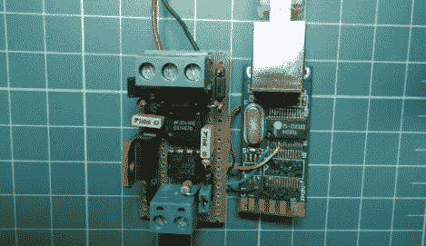

# USB 转 RS-232 适配器被破解，改为使用 RS485

> 原文：<https://hackaday.com/2012/10/08/usb-to-rs-232-adapter-hacked-to-use-rs485-instead/>

[André Sarmento]需要将计算机连接到 RS-485 总线。一个简单的转换器可以在网上找到，但他在当地唯一能找到的东西是一个 USB 到 RS-232 转换器。他用那个组件制作了自己的 USB 转 RS-485 桥。

RS-485 通常用于远程传感器，因为它提供了一种远距离连接电子设备的方法。他开始使用的转换器似乎被包裹在一种类似热熔胶的物质中。用手电筒照了一会儿，他就能看到电路板上的元件了。有两个阶段，一个将 RS-232 转换为 TTL，另一个将 TTL 转换为 USB。[André]取下 RS-232 芯片，将他自己的电路板(如左图所示)接入 TTL 线路。他还增加了一些配置选项，比如使用外部电源，以及一些跳线选择电阻选项。