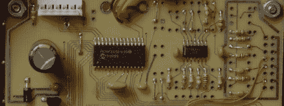

# USBPIC 几乎可以控制任何东西

> 原文：<https://hackaday.com/2012/09/23/usbpic-controls-just-about-anything/>

在过去的几年里，[Michael]一直在开发 PIC 微控制器板。他将他的项目称为 USBPIC ，加上一些 FET 驱动器、H 桥和 LED 驱动器，他自制的开发板几乎可以处理任何东西。

[Michael]的开发板是围绕 PIC18F2455 微控制器构建的，该微控制器具有在线串行编程接口和对 USB 端口的支持。[Michael]决定制作三种不同版本的 USBPIC，而不是采用模块化格式，即电路板可以通过屏蔽或扩展卡进行扩展。

TRANS USBPIC 包括 8 个 fet，用于关闭总计 32 安培的大电流设备。矩阵板的输出是传输板的两倍，但使用 ULN2803 或 UDN2982 芯片来驱动小电流器件。最后，HBSW 板采用 TRANS 板，用一个 L298 H 桥芯片代替四个 fet 来驱动两个 DC 电机。

对于[迈克尔]在模块化方面失去的东西，我们认为他获得了一个非常整洁的微控制器板，能够驱动从机器人到 LED 矩阵显示器的一切。