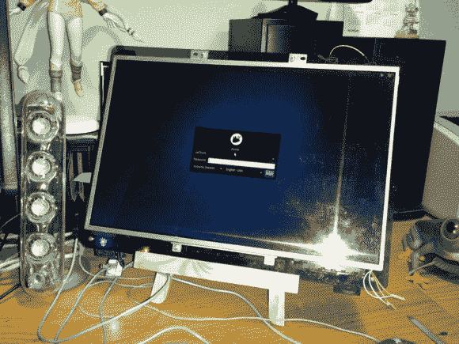
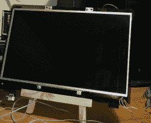
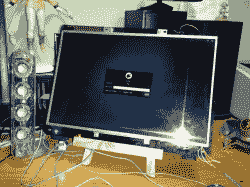
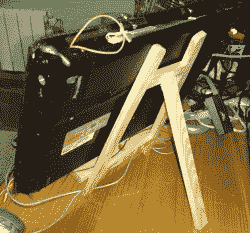
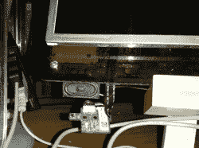
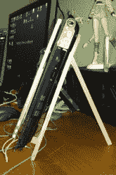

# 使用旧笔记本电脑作为第二台桌面显示器

> 原文：<https://hackaday.com/2012/12/05/use-an-old-laptop-as-a-second-desktop-display/>

当我们试图完成一个相对复杂的项目时，我们经常以打开 20 个窗口而告终。当这种情况发生时，我们通常会引用多个数据表、网页，并试图同时编写代码。我们看到有人用两三个显示器来缓解这种情况(通常称为战斗站)，但我们很便宜，没有理由只为这些场合购买更多显示器。嗯,[奥斯卡]可能有我们的解决方案。他的旧笔记本电脑一直放在一个未使用的盒子里，所以他翻转了屏幕，并建立了一个支架，将其作为办公桌上的附加显示器。

黑客只是简单地移除了铰链盖的屏幕，这样它就可以翻转过来。这将笔记本电脑变成了一个平板电脑，但没有触摸屏功能，但这可以在以后添加进来([我们已经在上网本](http://hackaday.com/2008/06/01/touchscreen-kit-for-eee-pc/)中看到了这一点)。他告诉我们，他在此过程中遇到的唯一问题是逆变器电缆的长度。他只是把它剪短，然后拼接上一点额外的长度。

[奥斯卡]没有写关于他的项目的帖子，但你可以在休息后看到构建画廊。

