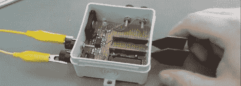

# 使用触摸传感器作为电报键

> 原文：<https://hackaday.com/2012/04/21/using-a-touch-sensor-as-a-telegraph-key/>

[塞巴斯蒂安]正在学习莫尔斯电码和连续波无线电，当然，他需要一个电报钥匙。他没有使用非常不符合人体工程学的拨片键，而是在几个晚上的时间里制作了一个[电容式触摸抑扬格键](http://www.electronics-blog.de/index.php/digital-electronics/77-capacitive-touch-sensor-based-morse-key)。

一个抑扬格键通常有两个开关。当一个开关闭合时，它将发出“抖动”信号。当另一个开关闭合时，它将发出“dah”信号。[Sebastian]没有使用机械拨片，而是通过使用触摸传感器将他的抑扬格键带入了 21 世纪。ATtiny45 测量一块金属板充满电所需的时间。这是美妙的 Arduino CapSense 库背后的相同想法。

这不是我们看到的第一个电容式触摸抑扬格键；[这个小家伙](http://hackaday.com/2011/12/05/an-iambic-keyer-in-5-minutes/)只是一对插入 Arduino 的金属触点和电阻。有了 ATtiny45，[Sebastian]的构建是一个完全成熟的抑扬格电报键，可以直接插入他的 CW 钻机。休息之后，你可以和[Sebastian]一起试着弹奏他的抑扬格调，看看这个项目的进展。

[https://www.youtube.com/embed/dBP2XldYD2E?version=3&rel=1&showsearch=0&showinfo=1&iv_load_policy=1&fs=1&hl=en-US&autohide=2&wmode=transparent](https://www.youtube.com/embed/dBP2XldYD2E?version=3&rel=1&showsearch=0&showinfo=1&iv_load_policy=1&fs=1&hl=en-US&autohide=2&wmode=transparent)