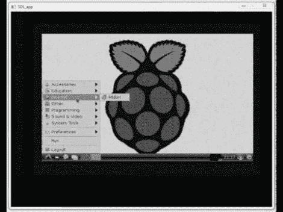

# 将示波器用作复合视频适配器

> 原文：<https://hackaday.com/2012/08/03/using-an-oscilloscope-as-a-composite-video-adapter/>

面对一台既不能显示 HDMI 信号也不能显示复合视频的显示器，[Joonas Pihlajamaa]承担了一项相当另类的任务:让他的示波器充当复合视频适配器。他使用的是 PicoScope 2204，但是任何连接到计算机并有 C API 的硬件都可以工作。诀窍在于他的代码如何使用 API 来解释信号。

首先要做的是确保复合信号中使用的电压电平在您的范围内。[Joonas]用他的万用表测量 RCA 连接器的中心极，发现 Raspberry Pi 板输出 200 mV 到 2V，正好在 PicoScope 的规格范围内。接下来，他开始分析信号。水平同步很容易找到，他忽略了颜色信息——选择单色输出以简化编码过程。下一个大难题是确定垂直同步，这样他就知道每一帧从哪里开始。他得到了它的工作，并作出了最后的改进，以处理交错。

休息后的概念验证视频展示了他做到了。有点模糊，但这就是合成视频通常的样子。

[https://www.youtube.com/embed/a5UQBVi5Xac?version=3&rel=1&showsearch=0&showinfo=1&iv_load_policy=1&fs=1&hl=en-US&autohide=2&wmode=transparent](https://www.youtube.com/embed/a5UQBVi5Xac?version=3&rel=1&showsearch=0&showinfo=1&iv_load_policy=1&fs=1&hl=en-US&autohide=2&wmode=transparent)