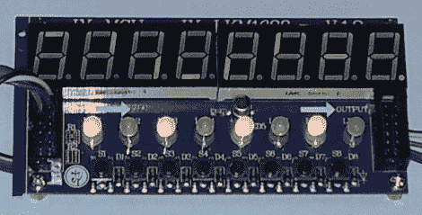

# 在 FPGA 中使用未记录的显示器

> 原文：<https://hackaday.com/2012/09/19/using-an-undocumented-display-with-an-fpga/>

当[Mike]在 Deal Extreme 上看到一个带有 8 个七段显示屏、8 个红/绿 led 和 8 个按钮的显示屏时，他知道它会在未来的项目中找到一个好归宿。但是，只有一个问题:除了 Arduino 库之外，没有任何文档可用于这个显示。想要将该显示器与 FPGA 板一起使用，[Mike]决定不要对协议进行位处理，而是将 C++代码移植到硬件实现中。

这款名为[TM 1638](http://dx.com/p/8x-digital-tube-8x-key-8x-double-color-led-module-81873)的极致显示器拥有足够多的七段显示器、led 和按钮，可以打造出非常酷的东西，而且令人惊讶的是，与微控制器的接口并不十分困难。TM1638 库仅通过三个引脚和一个简单的串行连接与外界通信。

在弄清楚发送什么命令来使显示器打开或关闭 led 之后，[Mike]为他的 Digilent Nexys2 和 Digilent Basys2 编写了一个硬件实现。现在，该显示器在 FPGA 上运行，就像它在 Arduino 上运行一样，并且是为[Mike]的 FPGA 调试 HDL 代码的一个很好的工具。