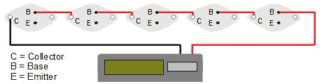

# 使用二极管和晶体管作为太阳能电池

> 原文：<https://hackaday.com/2012/04/13/using-diodes-and-transistors-as-solar-cells/>

当你认真对待它时，太阳能电池与你的零件抽屉里或你心爱的电子产品里的二极管和晶体管没有太大的区别。它们都是由硅或其他半导体制成的，令人惊讶的是，它们在有光的情况下也能发电。这里有两个半导体太阳能电池板项目，在过去的几天里进入了提示线。

[Steven Dufresne] [切开一个 2N3055 功率晶体管](http://rimstar.org/renewnrg/make_solar_cell_using_transistor_2n3055.htm)让半导体材料曝光。在阳光充足的情况下，他能够产生 500 毫伏和 5.5 毫安的电流。换句话说，他需要大约 5000 个这样的晶体管连接起来才能点亮一个紧凑型荧光灯。一个小计算器[有低得多的功率需求](http://rimstar.org/renewnrg/transistor_solar_cell_panel_calculator_2n3055.htm)，所以在打开五个晶体管后，他能够用少量的晶体管制造一个太阳能计算器。

[Sarang]正在研究太阳能电池，并意识到标准硅二极管非常相似；两者都是 pn 结，唯一真正的区别是表面积。他将一个 1N4148 连接到一个万用表上，令他惊讶的是，它竟然工作了。在放大镜的帮助下,[Sarang]能够从他的二极管获得大约 150 毫伏的电压。虽然他怀疑他的二极管是否比普通的太阳能电池更有效，但他认为它可以用于低成本、低功率的应用。我们认为这可能是一个有用的太阳能炊具或类似的高强度光探测器。

休息过后，你可以看看[史蒂文]和[萨兰]上传的展示他们太阳能电池的视频。

[https://www.youtube.com/embed/2bUc8RqSFXs?version=3&rel=1&showsearch=0&showinfo=1&iv_load_policy=1&fs=1&hl=en-US&autohide=2&wmode=transparent](https://www.youtube.com/embed/2bUc8RqSFXs?version=3&rel=1&showsearch=0&showinfo=1&iv_load_policy=1&fs=1&hl=en-US&autohide=2&wmode=transparent) [https://www.youtube.com/embed/ww_a9JS9IJ8?version=3&rel=1&showsearch=0&showinfo=1&iv_load_policy=1&fs=1&hl=en-US&autohide=2&wmode=transparent](https://www.youtube.com/embed/ww_a9JS9IJ8?version=3&rel=1&showsearch=0&showinfo=1&iv_load_policy=1&fs=1&hl=en-US&autohide=2&wmode=transparent)