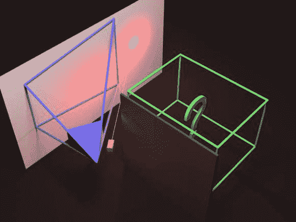

# 利用光的回声将墙壁变成镜子

> 原文：<https://hackaday.com/2014/06/23/using-echoes-of-light-to-turn-walls-into-mirrors/>

[Matthias]最近发表了一篇论文，他在论文中详细描述了他的团队如何以合理的价格利用一面墙作为镜子重建一个隐藏的场景。一个改进的[飞行时间照相机](http://en.wikipedia.org/wiki/Time-of-flight_camera) (PMD 康博德纳米公司)被用来精确地知道短脉冲光何时回到它的传感器。在上面的图片中，蓝色代表相机的视野。绿框是感兴趣的 1.5 米* 1.5 米* 2.0 米的场景，我们很确定你已经知道照明源，激光，以红色显示。

正如你所猜测的，这次经历中的主要挑战是找出击中相机的三次反射光来自哪里。由于激光需要与相机的曝光周期同步，非常有趣的是，挑战的一部分是打开后者以嗅出正确的信号。光照条件对它们达到的 15cm 公差影响有限。