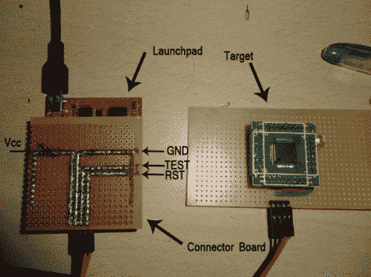

# 将 Spy-Bi-Wire 与 MSP430 Launchpad 配合使用

> 原文：<https://hackaday.com/2012/05/29/using-spy-bi-wire-with-the-msp430-launchpad/>

[Suraj]一直在研究一些不适合 Launchpad 板的更大的 MSP430 芯片。但这没关系，因为他建立了一个屏蔽，并写了一个关于使用间谍双线协议对芯片编程的指南。

SBW 是一个四线接口。过去[我们使用电路板的所有编程连接进行在线编程](http://hackaday.com/2010/09/28/launchpad-not-limited-to-value-line-chips/)，但是支持 SBW 的芯片只需要连接到 SBW 和测试引脚(当然其他两个连接用于电压和接地)。该屏蔽将四个引脚集合成一个公引脚接头。在上图中，[Suraj]正在使用该技术对 MSP430F4152 进行编程。他的指南是基于 Windows 的，但是回过头来看，[Sprite_TM]向[展示了如何在 Eclipse](http://hackaday.com/2011/02/24/debugging-msp430-using-eclipse/) 中调试时使用 SBW。