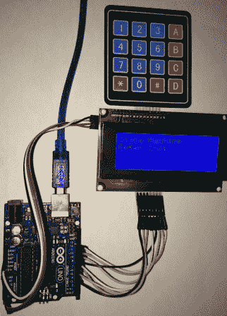
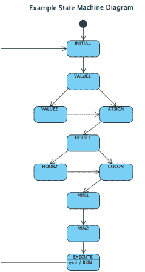

# 在项目中使用状态机

> 原文：<https://hackaday.com/2014/05/27/using-state-machines-in-your-projects/>



[Tony]开发了一种使用[状态机](http://hackaday.io/post/2774)来验证键盘输入的方法。他的方法是在命令由 16 个按钮的键盘输入时，一个字符一个字符地检查。状态机通常用于将复杂的问题分解成连续的任务，使得代码开发更加容易。虽然[托尼的]例子使用了键盘、Arduino Uno 和字符 LCD，但该理论可以应用于许多项目，如[这款 Dahlander 电机开关](http://hackaday.com/2014/04/02/arduino-controlled-dahlander-motor-switch/)。

如您所见，状态机可以非常灵活。休息过后，请不要走开，我们来看看[托尼的]状态机，并简要解释一下它是如何工作的。

目标是确保命令被正确地输入到系统中——在这种情况下，每按一次键，命令就会被逐个字符地验证。一个[状态机](http://blog.markshead.com/869/state-machines-computer-science/)用于实现这个目标。命令是:

```
XX@HH:MM#
```

```
Where:
```

```
XX = 1-99
```

```
HH = 0-24
```

```
MM = 00-59
```

```
# = Execute
```

每个值都被视为一个状态。输入该值后，它将进入下一个状态。所以:



请务必查看[Tony 的]项目以了解更多细节，并了解他如何用代码实现上述状态机。