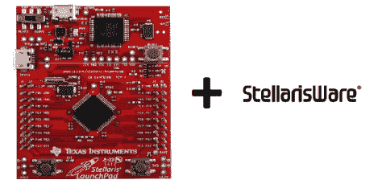

# 将 StellarisWare 与 Launchpad 一起使用

> 原文：<https://hackaday.com/2012/10/14/using-stellarisware-with-the-launchpad/>

[](http://hackaday.com/?attachment_id=88010)

在上一次 [Stellaris 操作指南](http://hackaday.com/2012/10/11/getting-started-with-the-stellaris-launchpad/ "Getting Started with the Stellaris Launchpad")中，我们让电路板工作，并设置了一些寄存器来打开 LED。这次我们将开始使用 StellarisWare Driverlib，它为微控制器的外设(包括 GPIOs、UARTs、ADC 等)提供驱动程序。这些库使得控制外设变得更加容易。我们将构建 Driverlib 项目，从头开始创建一个项目以使用该库，并运行一个简单的 LED 闪烁示例。

### 生成驱动程序库:

首先，我们将把 Driverlib 项目添加到 Code Composer Studio 工作区:

*   项目->导入现有的 CCS Eclipse 项目
*   单击浏览并选择 StellarisWare\driverlib 文件夹
*   检查驱动程序 lib-cm4f
*   单击完成

我们必须构建 Driverlib 项目，这样我们就可以将它作为一个库:

*   在项目资源管理器中右键单击 driverlib-cm4f 项目
*   单击“生成项目”

### 创建项目:

接下来，我们需要用正确的包含和库引用创建一个项目。使用正确的设置创建新项目:

*   文件->新建-> CCS 项目
*   家庭:手臂
*   变体:Stellaris LM4F120H5QR
*   连接:Stellaris 在线调试接口
*   在“空项目”下选择“空项目(带有 main.c)”
*   单击完成

首先添加驱动程序库:

*   项目->属性
*   生成-> ARM 链接器->文件搜索路径
*   点按“包括库文件或命令文件作为输入”旁边的添加
*   单击工作区…
*   选择 driver lib-cm4f/Debug/driver lib-cm4f . lib
*   单击确定

现在将 StellarisWare 添加到包含搜索路径:

*   项目->属性
*   构建-> ARM 编译器->包含选项
*   单击“将目录添加到#include 搜索路径”旁边的添加
*   单击文件系统…
*   选择 StellarisWare 安装目录(即 C:\ti\StellarisWare)
*   单击确定

此时，项目应该设置为使用 Driverlib。让我们尝试一个简单的例子，以确保它的工作。

### 使用 Driverlib:

这个例子只是闪烁两种颜色的 LED。这与 TI 的[项目 0](http://processors.wiki.ti.com/index.php/Stellaris_LM4F120_LaunchPad_Blink_the_RGB "Project 0") 类似，只不过我们的项目将从零开始构建。这个 main.c 文件将包含所需的库，初始化外设，并使 LED 闪烁:

```
#include "inc/hw_gpio.h"
#include "inc/hw_memmap.h"
#include "inc/hw_sysctl.h"
#include "inc/hw_types.h"
#include "driverlib/gpio.h"
#include "driverlib/sysctl.h"
#define LED_RED GPIO_PIN_1
#define LED_BLUE GPIO_PIN_2
#define LED_GREEN GPIO_PIN_3
void main(void) {
  // configure system clock to run at 50 MHz
  // use external crystal (16 MHz) and PLL
  SysCtlClockSet(SYSCTL_SYSDIV_4|SYSCTL_USE_PLL|SYSCTL_XTAL_16MHZ|
  SYSCTL_OSC_MAIN);
  // Enable PORT F GPIO
  SysCtlPeripheralEnable(SYSCTL_PERIPH_GPIOF);
  // set LED pins as outputs
  GPIOPinTypeGPIOOutput(GPIO_PORTF_BASE, LED_RED|LED_BLUE|LED_GREEN);
  // loop forever
  for (;;) {
    // set the red LED pin high, others low
    GPIOPinWrite(GPIO_PORTF_BASE, LED_RED|LED_BLUE|LED_GREEN, LED_RED);
    // delay
    SysCtlDelay(2000000);
    // set the green LED pin high, others low
    GPIOPinWrite(GPIO_PORTF_BASE, LED_RED|LED_BLUE|LED_GREEN, LED_GREEN);
    // delay
    SysCtlDelay(2000000);
  }
}
```

让我们构建并运行项目:

*   单击运行->调试
*   单击运行->恢复

希望 LED 会闪烁红色和绿色。现在库可以工作了，您可以访问所有外围设备的驱动程序。有关 Driverlib 的完整文档，请参见 [Stellaris 外设驱动程序库用户指南](http://www.ti.com/lit/ug/spmu019o/spmu019o.pdf "User's Guide")。你也可以看看 TI 的[stellar is launch pad Workshop](http://processors.wiki.ti.com/index.php/Getting_Started_with_the_Stellaris_EK-LM4F120XL_LaunchPad_Workshop?DCMP=stellaris-launchpad&HQS=stellaris-launchpadtraining "Stellaris Launchpad Workshop")。