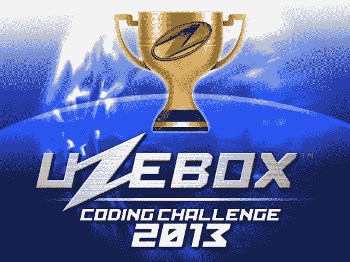

# Uzebox 编码挑战

> 原文：<https://hackaday.com/2013/02/28/uzebox-coding-challenge/>

2013 年 [Uzebox 编码挑战赛](http://uzebox.org/forums/viewtopic.php?p=10923#p10923 "Uzebox Coding Challenge")目前正在进行中。本次比赛将持续到 6 月 1 日，报名截止到 4 月 1 日。 [Uzebox](http://belogic.com/uzebox/index.asp "Uzebox") 是一款开源的 8 位游戏控制台，只使用了两个芯片:一个 ATmega644 微控制器和一个 AD725 RGB 到 NTSC 转换器。我们已经在过去的中对它进行过几次特别报道[。](http://hackaday.com/tag/uzebox/ "Uzebox on HaD")

竞赛规则相当宽松:开发一个游戏或一个有用的软件，运行在 Uzebox 上，大小在 61 kB 以内。参赛作品将根据游戏性、原创性、图像、声音、完整性和技术实力进行评判。前六名有奖品，包括几个乌兹盒和现金。

如果你没有 Uzebox，那就试试 [Uzem 模拟器](http://uzebox.org/wiki/index.php?title=Emulator "Uzem Emulator")。这让您可以在 Windows、Mac 或 Linux 上模拟 Uzebox 硬件。模拟器还有一个内部的 GDB 调试服务器来帮助开发。低成本的控制台可以用大约 30 美元建造，许多[套件](http://uzebox.org/shop/catalog/product_info.php?cPath=22&products_id=41 "Uzebox Base Kit") [可用](https://www.sparkfun.com/products/9023? "Uzebox Kit on Sparkfun")。

感谢[本]发送此邮件。