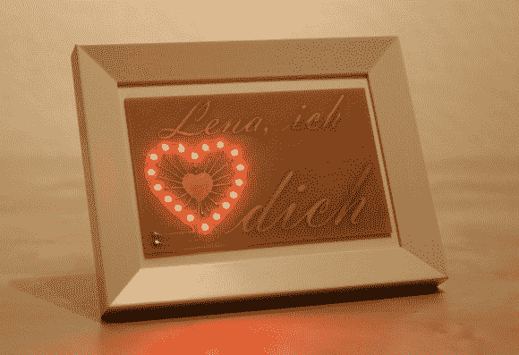

# 情人节的 PCB 让你的心融化

> 原文：<https://hackaday.com/2014/02/14/valentines-pcbs-to-make-your-heart-melt/>

你是否曾经坐在床上，盯着一瓶三氯化铁，心想“我应该用它做点什么…”[托拜厄斯]有。他想用他的修补技能让他的女朋友开心，所以他决定制作这个漂亮的蚀刻印刷电路板，向她表达他的爱。

这个项目很酷的一点是[Tobias]以前从未蚀刻过 PCB，甚至没有接触过 SMD 零件！在他的计算机上设计了 PCB 布局后，他将其打印在喷墨透明胶片上，并应用到他的 PCB 上。曝光 14 分钟后，他将电路板放入显影液中约 60 秒——它已经开始看起来不错了！然后，他拿出他信任的三氯化铁瓶子，开始蚀刻过程。

电路板被蚀刻后，他将 18 个红色 PLCC-2 led 焊接到位，每个 led 都有自己的 330 欧姆电阻。不满足于简单的开/关开关，[Tobias]决定用稳压器和 mosfet 编程一个小饰品，让它脉冲开和关，类似于跳动的心脏！完成的项目看起来很棒，我们相信他的女朋友会喜欢的。

为你所爱的人做这种令人讨厌的事情的另一个好处是，这将增加他们对闲置工具和不太漂亮的半成品项目的接受度！