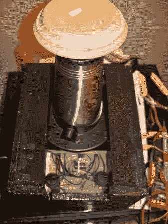

# 汽化器重建

> 原文：<https://hackaday.com/2013/08/01/vaporizer-rebuild/>

等等！先不要走开。是的，这是一个蒸发器项目，但它是我们有史以来最以电子工程为导向的帖子。[Mm Nn]蒸发器坏了，所以他决定修理它。在里面翻来翻去之后，很明显，几乎所有的东西都被破坏了。因此，这最终成为所有支持电路的完全重建，加热元件是他唯一能够挽救的电子元件。

他开始四处寻找能够驱动 Arizer V 塔蒸发器中元素的电源。他希望能使用一台 PSU 电脑，但最终不得不买一台合适的电脑；一口 rs-100-24 平均井。他用微控制器(汇编编程)驱动系统，用 PWM 调节元件。说到这里，有一个内置在加热元件中的传感器，[Mm]没有使用，因为他不知道如何读取它。如果你有一些想法，请在评论中告诉我们。