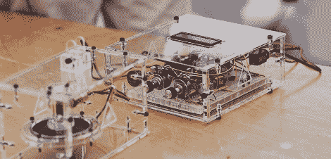

# 使用摇动滚珠轴承的变频激光器

> 原文：<https://hackaday.com/2012/09/19/variable-frequency-laser-using-shaken-ball-berings/>

激光器通常只发射一种颜色或一种频率的光。这对于激光指示器或 DVD 播放器中的激光二极管来说是正确的。[Kevin]听到了利用摇动的金属颗粒制造可变波长激光器的最新研究成果，[决定建造自己的](http://brainsinjars.com/archives/2012/09/build-log-shaken-granular-laser/)。

当[Kevin]读到一篇新科学家的博客文章关于用摇动的金属颗粒制造变频激光器时，他知道他必须继续努力。他翻出[arxiv 文章](http://arxiv.org/abs/1205.5977)，意识到实验设置相当简单，只需一点家庭工程就能轻松实现。

[凯文]的装置的工作原理是将数千个小滚珠轴承放入装有激光染料的小瓶中。为了振动染料中的粒子，[凯文]将他的染料容器和轴承安装在一个音频扬声器上，并使用频率发生器来振动滚珠轴承。

当一束 30mW 的绿色激光穿过装有滚珠轴承和染料的小瓶时，激光会将颜色变成非常亮的黄色。通过以 35 到 45 赫兹的频率振动瓶子，[凯文]可以改变激光的频率或颜色。

[凯文]只能改变激光的频率大约 30 纳米，或者大约与红橙色和橙黄色相同的颜色变化。尽管如此,[凯文]能够在家里进行最先进的物理研究还是相当令人惊讶的。

遗憾的是，我们找不到[凯文]的变频激光的任何视频。如果你能找到一个，把它发到举报热线，我们会更新这个帖子。